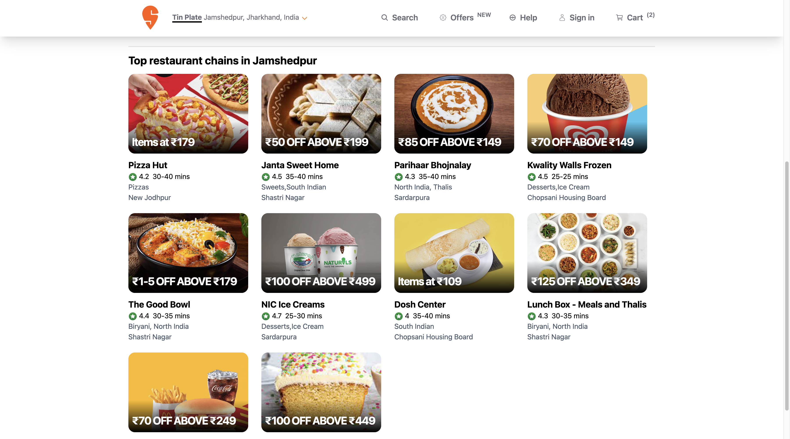

# 🍽️ Swiggy Clone

Welcome to the Swiggy Clone project! This is a full-stack application built using Node.js for the backend and React.js for the frontend. The application mimics the core functionalities of the Swiggy food delivery service.

## 📸 Screenshots

### Home Page


### Restaurant Listings


## 📹 Screen Recording

Check out the screen recording to see the application in action!


## 🛠️ Tech Stack

- **Frontend:** React.js, Tailwind CSS
- **Backend:** Node.js, Express.js


# Project Setup

Follow these steps to set up the project on your local machine.

1. Clone the repository:
   ```sh
   git clone https://github.com/yourusername/swiggy-clone.git

2. Install the dependencies for frontend:

    ```sh
    cd My-swiggy-project
    npm install

3. Install the dependencies for the backend:
   
   ```sh
   cd ../swiggy-app
   npm install

4. Start the development servers 
   ```sh
   <!-- # In the My-swiggy-project directory -->
    npm start
    <!-- # In the swiggy-app directory -->
    npm run dev

## 🤝 Contributing

Contributions are welcome! Please fork the repository and create a pull request with your changes.